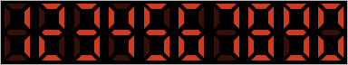
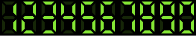

# LCD-display
LCD display as an angular component.  Choose your colors,size and number range!

# How to use it!
Download lcd-display-component floder 
Paste it into your angular app, 
and declarate it in declarations array in app.module.ts, 
then you can use lcd-component 

# HTML template
\<app-lcd-display\>\</app-lcd-display\>

# Component inputs:
  
  <ul>
 <li><strong>number</strong> - Number to display. Default 0</li>
 <li><strong>backgroundColor</strong> - Display's background-color. Default #000 (black)</li>
 <li><strong>width</strong> - Digit width. Default 20px</li>
 <li><strong>height</strong> - Digit height. Default 40px</li>
 <li><strong>activeColor</strong> - Active lines color. Default rgb(243, 0, 0) (bright-red)</li>
 <li><strong>disabledColor</strong> - Disabled lines color. Default rgb(60, 0, 0) (dark-red)</li>
 <li><strong>maxNumberLength</strong> - Maximal number of digits in number. Each number with more digits then maxNumberLength'll be writen like 9*maxNumberLength for example: maxNumberLength = 3 => 999 Setting this value to null this option'll be disactiated. Default null</li>
 <li><strong>minNumberLength</strong> - Minimal number of digits in number. Each number with less digits then minNumberLength'll be writen for example: minNumberLength = 4; number = 21 => 0021 Setting this value to null this option'll be disactiated .Default null</li>
 </ul>
